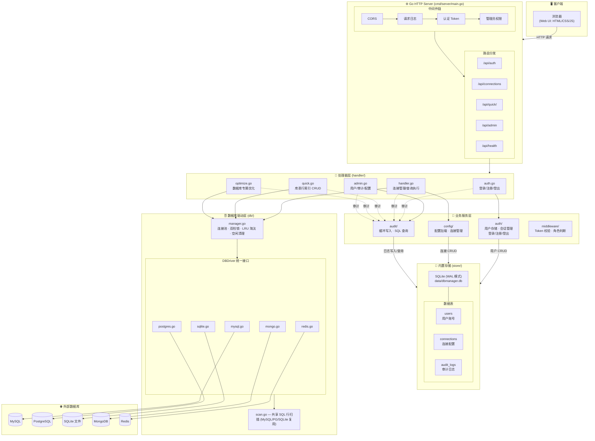

# dbmanager - 数据库连接管理工具

一个基于 **Go + Web** 的轻量级数据库纳管平台，可统一纳管多种常见数据库，通过浏览器完成连接管理、库表管理、SQL 查询、数据操作、**用户权限管理、审计日志、数据库优化**等。服务打包为 Docker 镜像，一键部署。

## ✨ 功能特性

### 核心功能
- **多数据库支持**：MySQL、PostgreSQL、SQLite、MongoDB、Redis 五种数据库统一纳管
- **连接管理**：连接的增删改查，配置持久化存储，一键测试连接（含延迟）；连接严格按创建者隔离，每个用户仅可见/可操作自己创建的连接
- **连接池**：自动管理连接复用与保活检测
- **库表管理**：
  - MySQL/PostgreSQL 支持库列表展示、快速切换、建库/删库
  - 表列表展示，表级快捷操作（新建、改名、删除，均二次确认）
- **数据操作**：
  - SQL/命令在线执行，结果表格化展示
  - 行级快捷操作：插入、更新（自动生成主键条件的 UPDATE 示例）、删除（二次确认）
  - 索引创建/删除
- **快捷切换**：SQL 编辑器顶部连接快速切换下拉，切换即同步刷新
- **Web UI**：现代化单页应用，左侧连接/库/表导航 + 右侧查询面板

### 权限与安全
- **用户认证**：基于 Token 的会话管理，登录后自动续期，超时自动登出
- **角色体系**：
  - **系统管理员**：启动时从配置文件自动创建，负责用户管理与系统配置
  - **普通用户**：注册后需管理员审批才能登录，使用数据库功能
- **连接隔离**：连接资源严格按创建者隔离，普通用户与管理员均仅可见/可操作自己创建的连接
- **注册审批**：用户注册后状态为待审批，管理员可通过/禁用/删除
- **角色升降级**：管理员可将普通用户设为管理员（保护机制：不能修改自己角色、不能取消最后一个管理员）
- **权限控制**：管理功能仅管理员可用，数据库功能需登录，连接数据按用户严格隔离

### 审计与监控
- **审计日志**：所有平台操作（登录、注册、审批、库表操作、SQL 执行、优化操作等）均记录到内置 SQLite 数据库，含时间、用户、角色、操作类型、资源、详情、IP、User-Agent，支持按用户/操作类型筛选
- **在线用户统计**：实时显示当前在线用户数及列表（用户名、角色、登录时间、最后活跃、IP），自动刷新

### 系统配置
- 统一配置文件 `config.json`，可配置：
  - 系统管理员用户名/密码
  - 数据目录（SQLite 数据库文件存放位置）
  - 会话超时时间

### 数据库专属优化
针对每种数据库的特性提供专属优化操作（工具栏「⚡ 数据库优化」入口）：

| 数据库 | 优化功能 |
|--------|----------|
| **MySQL** | EXPLAIN 执行计划分析、SHOW PROCESSLIST 进程列表 |
| **PostgreSQL** | Schema 管理（建/删/列）、EXPLAIN ANALYZE、VACUUM（FULL/ANALYZE）、ANALYZE、REINDEX、表大小统计、序列列表 |
| **SQLite** | PRAGMA 管理面板（journal_mode/synchronous/foreign_keys/cache_size 等可视化读写）、VACUUM、REINDEX、EXPLAIN QUERY PLAN、版本信息 |
| **MongoDB** | 聚合管道、countDocuments、distinct 去重、集合统计、数据库统计、高级查询（排序/分页/投影） |
| **Redis** | 类型感知 Key 操作（String/Hash/List/Set/ZSet 各自增删改查）、TTL 管理、SCAN 替代 KEYS（生产安全）、服务器 INFO、DBSize、FlushDB |

## 🏛️ 项目架构图



### 请求处理流程

```
浏览器 ──HTTP──▶ CORS ──▶ 请求日志 ──▶ 路由分发 ──▶ [认证中间件] ──▶ [管理员中间件]
                                                              │
                                                              ▼
                                                       Handler 处理器
                                                     ╱      │       ╲
                                                业务服务   连接池    审计记录
                                               (auth/    (manager   (audit/
                                                config/    .go)     buffer)
                                                store/)     │         │
                                                            │    ┌────┘
                                                            ▼    ▼
                                                     ┌──────────────────┐
                                                     │  SQLite (WAL)    │
                                                     │  dbmanager.db    │
                                                     │  users / conns   │
                                                     │  audit_logs      │
                                                     └──────────────────┘
                                                            │
                                                            ▼
                                                     外部数据库驱动
                                                     MySQL PG Mongo Redis
```

### 关键设计决策

| 设计点 | 方案 |
|--------|------|
| HTTP 框架 | Go 标准库 `net/http`，零第三方依赖 |
| 内置存储 | SQLite (WAL 模式) 统一存储用户、连接、审计日志，`modernc.org/sqlite` 纯 Go 无 CGO |
| 连接池 | 双检锁 + LRU 淘汰 + 空闲连接定时清理 (max=50) |
| SQL 扫描 | `scan.go` 共享 `queryRows`，MySQL/PG/SQLite 三驱动复用 |
| Redis 批量 | Pipeline 批量 TYPE+TTL，消除 N+1 查询 |
| 审计日志 | 内存缓冲 (≥100条或5s) + 事务批量 INSERT + SQL 索引查询 |
| 连接隔离 | 连接归属创建用户（created_by），列表过滤 + 接口级 403 校验，管理员无特权 |
| 会话管理 | 内存 Token + 自动续期 + 超时清理 |
| 优雅关闭 | `signal.NotifyContext` → `srv.Shutdown` → `audit.Flush` → `db.CloseAll` → `store.Close` |
| 安全 | `MaxBytesReader` 限流 · `url.QueryEscape` 防注入 · CORS 白名单 |

## 🏗️ 项目结构

```
dbmanager/
├── cmd/server/main.go          # 服务主入口（HTTP 路由、优雅关闭）
├── config.json                 # 系统配置文件（管理员账号、数据目录、端口等）
├── internal/
│   ├── model/model.go          # 数据模型定义（用户、审计日志、连接等）
│   ├── store/sqlite.go         # 内置 SQLite 存储引擎（WAL 模式，建表，统一管理）
│   ├── config/config.go        # 配置管理 + 连接 CRUD（SQLite 持久化）
│   ├── db/                     # 数据库驱动层
│   │   ├── manager.go          # 连接池管理器（双检锁·LRU·空闲清理）
│   │   ├── scan.go             # 共享 SQL 行扫描（MySQL/PG/SQLite 复用）
│   │   ├── mysql.go            # MySQL 驱动
│   │   ├── postgres.go         # PostgreSQL 驱动
│   │   ├── sqlite.go           # SQLite 驱动（外部 SQLite 文件连接）
│   │   ├── mongo.go            # MongoDB 驱动（含聚合、统计等）
│   │   └── redis.go            # Redis 驱动（Pipeline 批量·类型感知）
│   ├── auth/                   # 认证与用户存储
│   │   ├── store.go            # 用户存储（SQLite 后端）
│   │   ├── session.go          # 会话/Token 管理（内存）
│   │   └── auth.go             # 登录/注册/登出逻辑
│   ├── audit/audit.go          # 审计日志（缓冲写入 + SQLite 存储）
│   ├── middleware/middleware.go # 认证与权限中间件
│   └── handler/
│       ├── handler.go          # HTTP API 处理器
│       ├── quick.go            # 快捷操作 API（库/表/行/索引）
│       ├── auth.go             # 认证 API
│       ├── admin.go            # 管理 API（用户/审计/在线用户/配置）
│       └── optimize.go         # 数据库专属优化 API
├── web/                        # 前端静态资源
│   ├── index.html
│   ├── style.css
│   └── app.js
├── data/                       # 数据目录（运行时自动创建）
│   └── dbmanager.db            # SQLite 数据库（用户/连接/审计日志）
├── Dockerfile                  # 多阶段构建镜像
├── docker-compose.yml          # Docker Compose 部署
├── docker-compose-full.yml     # 含测试数据库的一键部署
└── README.md
```

## 🚀 快速开始

### Docker Compose 部署（推荐）

```bash
docker-compose up -d
# 访问 http://localhost:8080
# 默认管理员账号：admin / admin123
```

### Docker 直接运行

```bash
docker build -t dbmanager:latest .
docker run -d --name dbmanager -p 8080:8080 \
  -v dbmanager_data:/app/data \
  dbmanager:latest
```

### 本地开发运行

```bash
go run ./cmd/server
# 或编译
go build -o dbmanager ./cmd/server
./dbmanager
```

### 一键体验（含测试数据库）

`docker-compose-full.yml` 内置 MySQL/PostgreSQL/MongoDB/Redis 测试实例，全部启动后可在 UI 中直接添加连接体验：

```bash
docker-compose -f docker-compose-full.yml up -d
```

| 服务 | 镜像 | 端口 |
|------|------|------|
| dbmanager | 自构建 | 8080 |
| dbmanager-mysql | mysql:8.0 | 13306 |
| dbmanager-postgres | postgres:16-alpine | 15432 |
| dbmanager-mongo | mongo:7 | 37017 |
| dbmanager-redis | redis:7-alpine | 16379 |

## ⚙️ 系统配置

通过 `config.json` 配置系统参数：

```json
{
  "port": "8080",
  "data_dir": "data",
  "session_timeout_minutes": 120,
  "admin": {
    "username": "admin",
    "password": "admin123"
  }
}
```

## 📦 支持的数据库

| 数据库 | 连接测试 | 库管理 | 表管理 | 行增删改查 | 索引 | 专属优化 |
|--------|:---:|:---:|:---:|:---:|:---:|:---:|
| MySQL | ✅ | ✅ | ✅ | ✅ | ✅ | ✅ |
| PostgreSQL | ✅ | ✅ | ✅ | ✅ | ✅ | ✅ |
| SQLite | ✅ | — | ✅ | ✅ | ✅ | ✅ |
| MongoDB | ✅ | — | ✅ | ✅ | ✅ | ✅ |
| Redis | ✅ | — | — | ✅ (Key) | — | ✅ |

## 🛠️ 技术栈

- **后端**：Go (net/http 标准库，无第三方框架依赖)
- **内置存储**：SQLite (WAL 模式) — `modernc.org/sqlite` 纯 Go 驱动，无 CGO 依赖
- **外部驱动**：go-sql-driver/mysql、lib/pq、mongo-driver、go-redis
- **前端**：原生 HTML/CSS/JavaScript
- **部署**：Docker 多阶段构建（alpine 运行时），数据卷持久化
